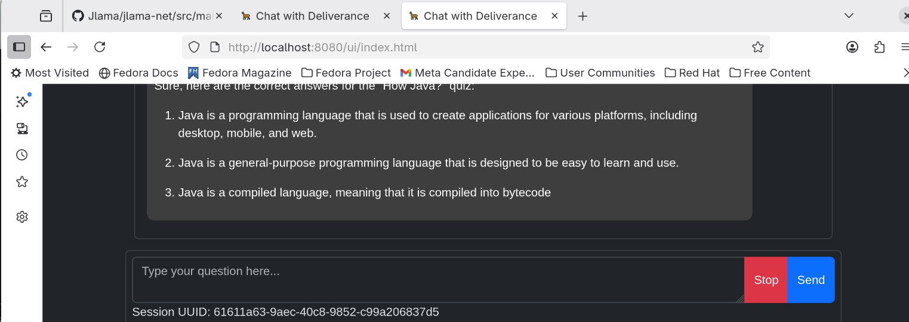

#### deliverance

The name `Deliverance` 

https://www.merriam-webster.com/dictionary/deliverance

: the act of delivering someone or something : the state of being delivered
especially : liberation, `rescue`

Have you ever spent 15 minutes building VLLM to end up with a disk full from its 20GB image and 60GB of docker layers?
Deliverance compiles < 1 minute. Int a 33MB boot application.

: something delivered
especially : an `opinion` or `decision` (such as the verdict of a jury) expressed publicly.

Could just go with j-inference open-jay-i that would be boring. We aren't `inferencing`, we are
`delivering`

### Lightning quick start 

```shell
 export JAVA_HOME=/usr/lib/jvm/java-24-temurin-jdk
 # dont skip the tets all the time they are fun, but just this time
 mvn package -Dmaven.test.skip=true
 cd web
edward@fedora:~/deliverence/web$ sh run.sh 
WARNING: Using incubator modules: jdk.incubator.vector
Standard Commons Logging discovery in action with spring-jcl: please remove commons-logging.jar from classpath in order to avoid potential conflicts

  .   ____          _            __ _ _
 /\\ / ___'_ __ _ _(_)_ __  __ _ \ \ \ \
( ( )\___ | '_ | '_| | '_ \/ _` | \ \ \ \
 \\/  ___)| |_)| | | | | || (_| |  ) ) ) )
  '  |____| .__|_| |_|_| |_\__, | / / / /
 =========|_|==============|___/=/_/_/_/

 :: Spring Boot ::                (v3.5.5)

2025-10-30T14:37:10.247-04:00  INFO 218011 --- [           main] n.d.http.DeliveranceApplication          : Starting DeliveranceApplication using Java 24.0.2 with PID 218011 (/home/edward/deliverence/web/target/web-0.0.1-SNAPSHOT.jar started by edward in /home/edward/deliverence/web)
2025-10-30T14:37:13.932-04:00  WARN 218011 --- [           main] i.t.deliverance.model.AbstractModel      : embedding TensorShape{tshape=[57, 2048], capacity=116736, sparseRange=Optional.empty} 116736
2025-10-30T14:37:32.561-04:00  WARN 218011 --- [           main] i.t.deliverance.model.AbstractModel      : After batch forward size: 116736 shape: TensorShape{tshape=[57, 2048], capacity=116736, sparseRange=Optional.empty}
Response{responseText='10000000000000000000000000000000000000000000000000000000000000000000000000000000000000000000000000000000000000000000000000000000000000000000000000000000000000000000000000000000000000000000000000000000', responseTextWithSpecialTokens='10000000000000000000000000000000000000000000000000000000000000000000000000000000000000000000000000000000000000000000000000000000000000000000000000000000000000000000000000000000000000000000000000000000', finishReason=MAX_TOKENS, promptTokens=56, generatedTokens=199, promptTimeMs=19012, generateTimeMs=77902}
2025-10-30T14:38:52.134-04:00  INFO 218011 --- [           main] o.s.b.a.w.s.WelcomePageHandlerMapping    : Adding welcome page: class path resource [public/index.html]
2025-10-30T14:38:53.002-04:00  INFO 218011 --- [           main] n.d.http.DeliveranceApplication          : Started DeliveranceApplication in 103.909 seconds (process running for 105.417)

```
We run n query on startup to warm the cache sorry :) otherwise it would start faster. Also first time has to 
download a model!

Open your browser to http://localhost:8080

<p align="center">
  
</p>


