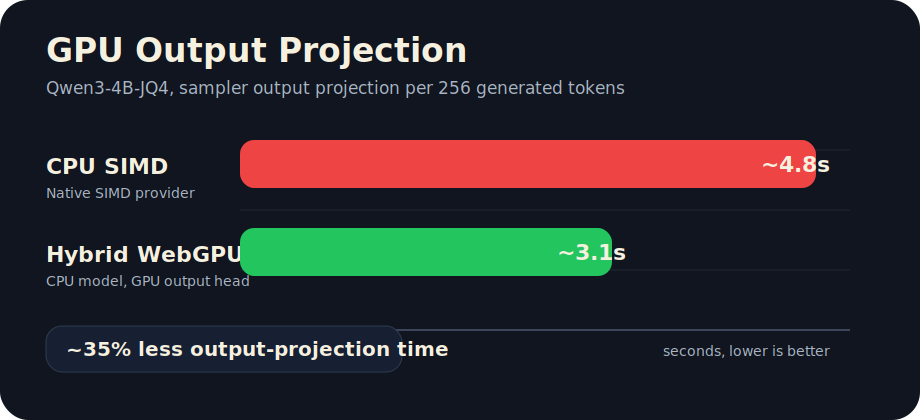

# GPU Output Projection

You heard only C and C++ get to party with GPUs? Deliverance can now use WebGPU/Dawn to offload work to GPUs, including the one in your Mac.



We did not have to go all-in on MLX or write a full Metal backend. Dawn gives us a portable path: Metal on macOS, Vulkan/DirectX elsewhere. That matters because Deliverance is still a Java inference engine, and we want GPU acceleration without turning the whole project into platform-specific glue code.

The interesting part is that we did not start by moving the entire model to the GPU. We profiled first.

In an LLM, after the transformer has computed the hidden state for the next token, the model still has to decide which token comes next. That decision starts with a big projection: take the final hidden vector and score it against every token in the vocabulary. For Qwen3-4B, that means taking a `1 x 2560` vector and multiplying it against a huge Q4 output-head matrix to produce logits for about 152K possible tokens.

That stage shows up in profiles as `sampler.output_projection`. In plain English: it is the expensive "score every possible next token" step before top-k/top-p sampling picks the winner.

The benchmark output makes the path visible:

```text
[command] benchmarks/run-qwen-single-benchmark.sh
[profile] sampler.output_projection count=256 total_ms=2976.468 mean_us=11626.829
[profile-counter] sampler.output_provider_gpu count=256
[profile-counter] sampler.output_weight_Q4 count=256
```

That says the output projection ran once per generated token, used the GPU path for all 256 generated tokens, and used Q4 output weights.

So we kept the transformer layers on Native SIMD CPU, registered the Q4 output weights with the WebGPU provider, and offloaded only that vocabulary-scoring step to the GPU. That avoided a major execution-engine overhaul while still hitting a real bottleneck.

Representative Qwen3-4B-JQ4 runs:

```text
CPU SIMD output projection:  ~4.6-5.0s per 256 generated tokens
Hybrid WebGPU output stage:  ~3.0-3.2s per 256 generated tokens
```

This is not a full GPU backend. The transformer blocks, attention, MLP, KV cache, and sampler still primarily run on CPU. It is a targeted offload for a specific stage where the data shape makes sense:

```text
small CPU hidden state -> huge GPU-resident Q4 output weights -> CPU logits
```

The result is a useful beachhead: Java orchestration, safetensors/JQ4 weights, WebGPU/Dawn, and a real GPU-backed inference stage without rewriting the whole engine.

## Current Limits

- GPU output projection is opportunistic. If Dawn/GPU support is unavailable, Deliverance falls back to the primary tensor provider.
- The optimized path currently targets `F32 x Q4 -> F32` output projection.
- Native GPU is not yet a general-purpose replacement for Native SIMD.
- Offset/sharded GPU GEMM cases are deliberately delegated until fully proven.
- Full Ollama-style Metal performance would require more GPU-resident graph execution, not just one offloaded stage.

## Related Pages

- [Tensor engines and JQ4](tensor_engines_and_jq4.md)
- [Native SIMD kernels](native_simd_kernels.md)
- [Benchmarking](benchmarking.md)
