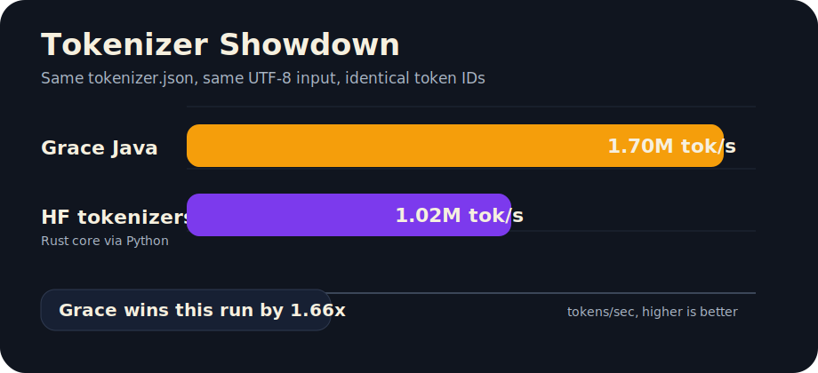

# Tokenizer Showdown

You hear on the internet that you should "prototype in Python, then optimize the hot parts in Rust." But what if you could just write it once in Java and have it run 1.6x faster?

This harness compares Deliverance Grace tokenization against Hugging Face's Rust-backed `tokenizers` package on the same local `tokenizer.json` and the same UTF-8 text corpus.



## What Is Grace?

Grace is Deliverance's Java tokenizer library: Hugging Face-style tokenizer behavior, Java APIs, local cache loading, special-token handling, byte-level BPE, decode support, chat-template integration, and parity tests against Hugging Face outputs. See the [Grace README](README.md) for details.

## Current Result

On a Qwen3 tokenizer corpus run, Grace produced identical token IDs and encoded about **1.66x more tokens/sec**.

```text
Grace Java
ids_sha256=fb2a093d773ec3ccf251f4bf5270b56711c6add4ef9a69d1c92af852ed80c900
tokens=15744
chars=61760
bytes=63936
mean_ms=9.282
tokens_s=1696105.1

Hugging Face tokenizers
ids_sha256=fb2a093d773ec3ccf251f4bf5270b56711c6add4ef9a69d1c92af852ed80c900
tokens=15744
chars=61760
bytes=63936
mean_ms=15.368
tokens_s=1024463.6
```

Summary:

```text
1,696,105 / 1,024,464 = 1.66x
```

Same tokenizer JSON. Same input bytes. Same token IDs. Grace won this round.

## What It Measures

The benchmark reports:

- token count
- SHA-256 of token IDs for a quick correctness check
- UTF-8 byte count and Unicode character count
- mean milliseconds per encode
- characters per second
- tokens per second

## Requirements

Install Hugging Face tokenizers for the Python side:

```sh
python3 -m pip install tokenizers
```

Make sure the tokenizer directory exists locally. The default is:

```text
~/.deliverance/Qwen_Qwen3-0.6B
```

## Run

From the repository root:

```sh
sh grace/scripts/run-tokenizer-showdown.sh
```

On machines with multiple Python installations, pin the interpreter that has `tokenizers` installed:

```sh
PYTHON=/usr/local/bin/python3 sh grace/scripts/run-tokenizer-showdown.sh
```

Override model/corpus/size:

```sh
MODEL_DIR="$HOME/.deliverance/Qwen_Qwen3-4B-JQ4" \
REPEAT=128 \
ITERATIONS=500 \
sh grace/scripts/run-tokenizer-showdown.sh
```

## Fair Caveats For The Rust/Python Crowd

This is a practical tokenizer benchmark, not a universal language benchmark.

- It tests one tokenizer family and one mixed corpus by default.
- Hugging Face's Python package calls into Rust, but the benchmark still enters through Python.
- Different tokenizer JSON files, corpus sizes, Unicode mixes, batching styles, and machines can change the result.
- This does not say Java is always faster than Rust. It says Grace was faster in this concrete local Qwen3 tokenizer run.
- Correctness comes first. The SHA values must match before the speed result matters.

The point is not that Rust is slow. The point is that a careful Java implementation can be fast enough to make the "rewrite hot paths in Rust" reflex worth questioning.

## Notes

This is a tokenizer benchmark, not a full generation benchmark. It intentionally instantiates each tokenizer once, warms up, waits 10 seconds between Java and Python runs, then repeatedly encodes the same mixed text block.
