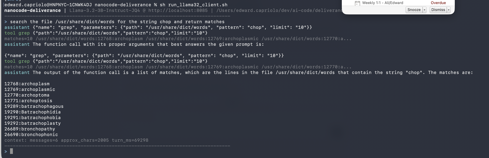

# nanocode-deliverance

Tiny terminal coding agent inspired by `nanocode.java`, backed by a running Deliverance HTTP server.



This module intentionally stays small:

* Java 17.
* Depends on `deliverance-client`.
* Provides minimal local tools: `read`, `write`, `edit`, `glob`, `grep`, `java_sandbox`.
* Risky/eval-prone `bash` is disabled unless explicitly enabled.

## Build

```sh
mvn -pl nanocode-deliverance -am -DskipTests package
```

Runnable jar:

```sh
java -jar nanocode-deliverance/target/nanocode-deliverance-0.0.10-SNAPSHOT-all.jar
```

## Start A Local Deliverance Server

From this directory:

```sh
sh run-server-llama-3.2-3b-instruct.sh
```

or:

```sh
sh run-server-tinyllama-chat.sh
```

Both scripts run the web jar from `../web/target` and default to `DELIVERANCE_PORT=8085`.
The client scripts also default to `http://localhost:${DELIVERANCE_PORT:-8085}` unless `DELIVERANCE_BASE_URL` is set.

## Run The Client

For Llama 3.2:

```sh
sh run_llama32_client.sh
```

For TinyLlama:

```sh
sh run_tiny_llama_client.sh
```

## Configuration

Environment variables:

* `DELIVERANCE_BASE_URL`, default `http://localhost:8080`
* `DELIVERANCE_MODEL`, default `default`
* `NANOCODE_NTOKENS`, optional total prompt+generation token budget
* `NANOCODE_MAX_TOKENS`, default `2048`
* `NANOCODE_MAX_TOOL_RESULT_CHARS`, default `2000`
* `NANOCODE_TEMPERATURE`, default `0.0`
* `NANOCODE_TOOLS`, default `true`
* `NANOCODE_STREAM`, default `true`
* `NANOCODE_JAVA_SANDBOX_IMAGE`, default `eclipse-temurin:25-jdk`

Flags:

```sh
--base-url http://localhost:8080
--model tjake/gemma-2-2b-it-JQ4
--max-tokens 4096
--max-tool-result-chars 2000
--temperature 0.0
--no-tools
--stream
--no-stream
--allow-risky-tools
```

`--allow-risky-tools` enables `bash`. Without it, shell execution is not advertised to the model and direct calls are rejected.

## Java Sandbox Tool

`java_sandbox` runs one-shot Java commands in a Testcontainers container with network disabled by default. It accepts files, copies them into `/workspace`, runs either a single Java file or Maven tests, and returns structured JSON with `exitCode`, `stdout`, `stderr`, `timedOut`, and `durationMs`.

Example tool arguments:

```json
{
  "mode": "single-file",
  "mainClass": "Main",
  "files": {
    "Main.java": "public class Main { public static void main(String[] args) { System.out.println(1 + 1); } }"
  },
  "timeoutSeconds": 10
}
```

## Notes

The module uses the generated `deliverance-client` `ChatApi` with a Jackson mix-in for request message serialization.
