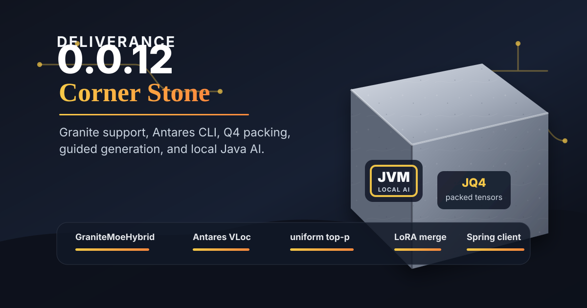

# Deliverance 0.0.12 Release Notes: Corner Stone



Deliverance 0.0.12 is the "Corner Stone" release. The name fits because this release builds directly on Granite support while also laying foundation pieces for local Java inference workflows: Antares vulnerability localization, better Q4 quantization, LoRA adapter merging, uniform top-p sampling, generated Spring clients, and a local mystery-game showcase.

These notes summarize the user-facing and developer-facing changes from the 0.0.11 release commit to `v0.0.12`.

## Highlights

- Added GraniteMoeHybrid / Granite 4.0 support, including Mamba, MoE, shared MLP, tests, docs, and benchmark scripts.
- Added Antares support and a dedicated Java Antares CLI for vulnerability localization workflows.
- Added `/v1/completions` compatibility for Antares-style clients and raw prompt workflows.
- Improved Q4 quantization with packed streaming output and Granite stacked expert tensor support.
- Added LoRA/PEFT adapter parsing and merge-at-load support.
- Added generated Spring client support and improved Spring AI integration.
- Added `uniform_top_p` as an option on top-p sampling for sampler-side random choices.
- Added the Dead to Rights local game showcase using guided JSON and Deliverance chat completions.
- Fixed guided JSON schema-to-regex behavior for Brics-compatible guided decoding.
- Added reasoning-field splitting and response handling improvements.

## GraniteMoeHybrid / Granite 4.0

0.0.12 adds the first serious Granite 4.0 hybrid model path:

- `GraniteMoeHybridConfig`
- `GraniteMoeHybridModel`
- `GraniteMoeHybridAttention`
- `GraniteMoeHybridMambaLayer`
- `GraniteMoeHybridMoeFeedForward`
- `GraniteMoeHybridSharedMlp`
- model registration through `ModelSupport`

The release includes Granite-focused tests and documentation, including tiny/synthetic checkpoint coverage and real-model fetch tests where appropriate. Granite profiling also gained more detailed timers for Mamba, MoE routing, expert matmuls, shared MLP work, and scan stages.

Quantization work in this release made Granite tiny substantially more practical by supporting known 3D stacked expert tensors in Q4 instead of leaving them dense.

## Antares And Vulnerability Localization

0.0.12 adds a dedicated `deliverance-antares-cli` module for Antares-style vulnerability localization.

The CLI supports:

- raw `/v1/completions` requests
- streaming output
- terminal, read-file, and submit tools
- command approval by default
- explicit unattended mode with `--yes-run-commands`
- CWE showcase scripts
- local VLoc smoke benchmark support

The release also adds Antares model/server configs and tests for prompt/template behavior. Antares 1B became the main local VLoc showcase path, while Antares 350M is documented as fast but unreliable for the current tool-use flow.

## OpenAI-Compatible Completions

Deliverance now includes minimal completions compatibility:

- `POST /v1/completions`
- `POST /completions`
- raw prompt passthrough
- streaming SSE chunks with `choices[0].text`
- final `[DONE]`
- generated client contract tests

This is intentionally useful for clients such as Antares that expect the older completions-style API rather than chat completions.

## Quantization Improvements

The Q4 quantizer received important production-quality improvements:

- packed streaming writes instead of many tiny safetensors files
- safer shard planning for quantized outputs
- Granite 3D stacked expert tensor detection
- Q4 support for selected Granite MoE expert tensors
- 3D Q4 load/get/slice tests
- `TensorDisplayUtil.pretty3dDisplay(...)`
- disabled one-shot quantize-on-demand integration tests for Antares 350M and Granite tiny

The packed output work significantly reduces file counts for quantized models while preserving index entries and tensor metadata.

## LoRA / PEFT Adapter Support

0.0.12 adds the core pieces for LoRA and PEFT adapter handling:

- adapter config parsing
- LoRA tensor-name helpers
- adapter model fetcher
- `MergingWeightLoader`
- merge-at-load support
- adapter benchmark script
- user-facing LoRA support docs
- tests for config parsing, tensor naming, profiles, adapter loading, and merge behavior

This release makes adapter support a real code path rather than just a future design note.

## Guided JSON And Sampling

Guided JSON decoding received a concrete compatibility fix in `JsonSchemaRegexBuilder`. The schema-to-regex path now avoids Brics-incompatible fragments that previously caused runtime failures for real guided JSON schemas.

0.0.12 also adds `uniform_top_p` as an option on top-p sampling:

```json
{
  "temperature": 1.0,
  "top_p": 0.95,
  "uniform_top_p": 1.0
}
```

`top_p` still defines the nucleus. Normal top-p then picks probability-weighted from that nucleus. When `uniform_top_p` is set, Deliverance picks uniformly from that same top-p nucleus.

The motivating use case is setup generation where an application wants one plausible random choice without generating a long list and discarding most of it. The new `core/uniform_top_p_game_setup.md` doc includes a measured Dead to Rights setup example showing a `5.69x` speedup for one local run.

## Dead To Rights Game

`nanocode-deliverance` now includes Dead to Rights, a light local mystery game backed by Deliverance chat completions.

The game demonstrates:

- local model-backed interactive generation
- guided JSON setup generation
- small prompt/context management
- non-thinking Qwen gameplay mode
- local server runner scripts
- game tests

Dead to Rights also drove the `uniform_top_p` work by exposing the cost of asking the model for long option lists only to pick one item in Java.

## Spring And Generated Clients

0.0.12 adds a generated Spring client module:

- `client-spring`
- generated model/API support
- contract tests for completions requests

The Spring AI integration was updated to map Deliverance-specific fields, including guided JSON, XTC, and `uniformTopP`. The embedded Spring AI module also gained mapper updates for the new sampling option.

## Reasoning And Prompt Handling

This release adds `ReasoningTextSplitter` and reasoning-field support improvements so responses can separate model reasoning from visible response text where the API supports it.

Prompt handling also received fixes for Jinjava expression-factory behavior and model-family tuning so Granite/Antares use the expected tool-call parser behavior.

## Docs And Benchmarks

New or updated docs include:

- Granite support
- LoRA support
- generator sampling
- uniform top-p game setup
- benchmarking
- Antares CLI
- Nanocode Antares showcase

New benchmark/support scripts include:

- Granite tiny benchmark runner
- LoRA adapter benchmark runner
- Antares showcase runners
- VLoc smoke benchmark runner

## Compatibility Notes

- `uniform_top_p` requires `top_p`; it is not a replacement top-p cutoff.
- Antares terminal commands require approval by default; unattended execution is explicit.
- Large real-model tests are intended to be opt-in or tagged appropriately.
- Generated client modules depend on the OpenAPI spec in `web/deliverance_specification.yaml`.
