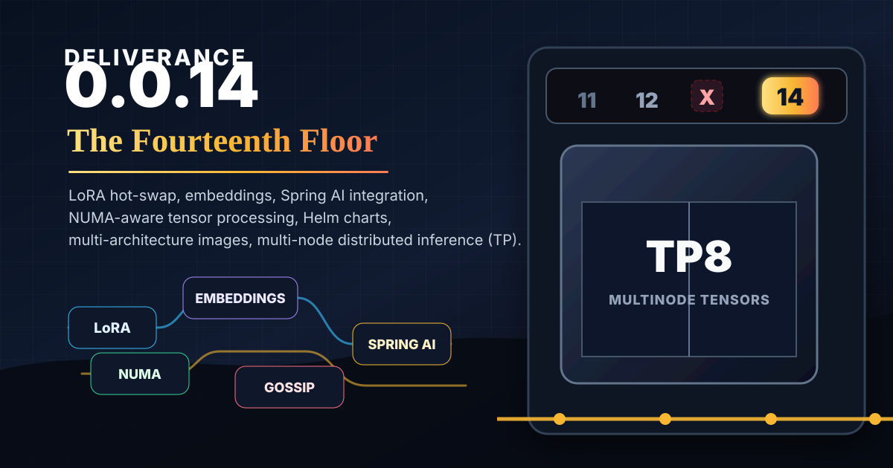

# Deliverance 0.0.14 Release Notes: The Fourteenth Floor

Deliverance 0.0.14 is the "Fourteenth Floor" release. The name is a small nod to the missing thirteenth floor: there was a `v0.0.13`, but the real passenger elevator stops here, with LoRA runtime support, embedding parity work, a much more operational tensor-parallel stack, Spring AI updates, and lower-level native/tensor runtime improvements.

These notes summarize the user-facing and developer-facing changes from `v0.0.12` through `v0.0.14`. Major work references include the merge commit or branch where most of the implementation landed.

## Highlights

- Added LoRA runtime hot-swap support on top of the earlier merge-at-load foundation.
- Improved embedding model correctness and added more sentence-transformers/BERT parity coverage.
- Hardened tensor-parallel generation enough to run a real Qwen3 0.6B TP8 `/chat/completions` request on GKE.
- Added a Helm chart for tensor-parallel GKE deployments, including shared Filestore RWX model cache support.
- Added Docker multi-arch build/push scripts for Deliverance images.
- Updated Spring AI integration while the upstream Spring AI PR path is still in flight.
- Added native/tensor runtime locality work, including tensor locality metadata and NUMA/affinity-aware execution experiments.
- Updated the Gossip dependency to `0.1.4` for liveness fixes needed by Kubernetes restarts and same-ID/new-URI behavior.

## LoRA Runtime Support

Major reference: [b028727 Add LoRA runtime hot-swap support](https://github.com/edwardcapriolo/deliverance/commit/b028727) ([#173](https://github.com/edwardcapriolo/deliverance/pull/173)).

0.0.12 introduced LoRA parsing and merge-at-load. 0.0.14 builds on that with runtime adapter operations:

- `LoraDeltaApplier` for applying adapter deltas during generation paths.
- Runtime model APIs for registering, unregistering, selecting, and clearing active adapters.
- LoRA hot-swap tests and integration coverage.
- Adapter benchmark script support under `benchmarks/run-lora-adapter-benchmark.sh`.
- Continued safetensors adapter profile and resolved-adapter tests.

The important change is that LoRA is no longer only a model-load-time experiment. The runtime can now manage adapters as part of a serving process.

## Embedding Support And Parity

Major references:

- [243d5ac Bert embed fix](https://github.com/edwardcapriolo/deliverance/commit/243d5ac) ([#177](https://github.com/edwardcapriolo/deliverance/pull/177))
- [d7503bf Sentense trans test](https://github.com/edwardcapriolo/deliverance/commit/d7503bf) ([#179](https://github.com/edwardcapriolo/deliverance/pull/179))
- [6af58c6 Embedding check](https://github.com/edwardcapriolo/deliverance/commit/6af58c6) ([#181](https://github.com/edwardcapriolo/deliverance/pull/181))
- [119aadb embedding bench](https://github.com/edwardcapriolo/deliverance/commit/119aadb) ([#182](https://github.com/edwardcapriolo/deliverance/pull/182))

Embedding support received a focused correctness pass:

- BERT embedding fixes and modeling tests.
- Sentence-transformers pooling and pretrained ported tests.
- `SentenceTransformersEmbeddingRecipe` and pooling support updates.
- Clearer reference-score checks against known production/reference behavior.
- Embedding benchmark coverage, including `EmbeddingInferenceProfilerBenchmarkTest` and ONNX comparison hooks.

The practical result is that embedding behavior is much less hand-wavy: multiple model/pooling paths now have explicit tests and benchmark scaffolding.

## Tensor Parallel Goes Operational

Major references:

- [dc4128b Changes for TP fixes](https://github.com/edwardcapriolo/deliverance/commit/dc4128b) ([#183](https://github.com/edwardcapriolo/deliverance/pull/183))
- [0890d8e Fix for gemmers](https://github.com/edwardcapriolo/deliverance/commit/0890d8e) ([#184](https://github.com/edwardcapriolo/deliverance/pull/184))
- [0737264 Prefix cache tp](https://github.com/edwardcapriolo/deliverance/commit/0737264) ([#186](https://github.com/edwardcapriolo/deliverance/pull/186))
- [4ba5670 Charts](https://github.com/edwardcapriolo/deliverance/commit/4ba5670) ([#188](https://github.com/edwardcapriolo/deliverance/pull/188))
- [527f3d4 new gossip](https://github.com/edwardcapriolo/deliverance/commit/527f3d4)
- [db60b6f TP docs](https://github.com/edwardcapriolo/deliverance/commit/db60b6f)

Tensor parallelism moved from mostly local runtime infrastructure toward an operational deployment path:

- Qwen tensor-parallel smoke and provider trace tests.
- Capacity-based assignment using live worker capacity records.
- Manual assignment fallback through `/tp/assign?nodeId=<gossip-id>&rank=<rank>`.
- Worker assignment reconciliation when local ranks change.
- Coordinator readiness reconciliation that can start before workers are fully ready.
- Rank HTTP client timeouts and cancellation for stuck rank calls.
- Netty collective support and cleanup tests for timed-out rounds.
- Explicit collective request sessions to isolate concurrent requests and repeated decode steps.
- Worker diagnostics endpoints for status, gossip, endpoints, active rank requests, and recent errors.
- Coordinator diagnostics endpoints: `/tp/status`, `/tp/gossip`, and `/tp/endpoints`.

The GKE smoke path successfully served a Qwen3 0.6B TP8 `/chat/completions` request. This proves correctness of the deployment path, not peak performance. TP8 on small CPU nodes remains overhead-sensitive.

## GKE Helm Deployment

Major reference: [4ba5670 Charts](https://github.com/edwardcapriolo/deliverance/commit/4ba5670) ([#188](https://github.com/edwardcapriolo/deliverance/pull/188)).

The new `charts/deliverance-tp` chart supports tensor-parallel deployments on Kubernetes:

- Coordinator Deployment running the Spring web server.
- Worker StatefulSet running `TpLocalCluster` rank workers.
- Qwen3 0.6B TP8 overlays.
- GKE overlays for tainted/dedicated node pools.
- 8 workers x 1 rank layout for TP8.
- 2 workers x 4 ranks debug layout.
- Shared ReadWriteMany model cache using GKE Filestore CSI.
- Coordinator-first install flow so the model is downloaded once before workers scale up.
- GKE runbook at `charts/deliverance-tp/GKE_QWEN_TP8.md` with commands, anonymized outputs, logs, readiness checks, and query examples.

Operational notes:

- Filestore CSI and `file.googleapis.com` must be enabled in the GCP project.
- The Filestore StorageClass network must match the cluster VPC.
- Filestore is billed by provisioned capacity and tier.
- Topology changes should be done with a full pod stop/start so in-memory gossip state does not mix assignments.

## Docker Multi-Arch Builds

Major references:

- [43b1e49 Docker](https://github.com/edwardcapriolo/deliverance/commit/43b1e49)
- [4ba5670 Charts](https://github.com/edwardcapriolo/deliverance/commit/4ba5670) ([#188](https://github.com/edwardcapriolo/deliverance/pull/188))

Docker build/push support was updated for the charted deployment path:

- Multi-arch build script with separate ARM64 and AMD64 tags.
- Manifest creation for `ecapriolo/deliverance:<version>`.
- Snapshot default tag support for `0.0.14-SNAPSHOT` during testing.
- Build args for `REPO_COMMIT_SHA` so images can be tied to exact commits.
- Maven dependency prefetch layer for better Docker build caching.
- Javadoc skip in the image build.
- `MAVEN_OPTS` build arg support for environments that need `-XX:TieredStopAtLevel=1` to avoid JDK compiler crashes.

## Gossip 0.1.4 Dependency

Major reference: [527f3d4 new gossip](https://github.com/edwardcapriolo/deliverance/commit/527f3d4).

Deliverance now depends on `io.teknek.gossip:0.1.4`. This matters for Kubernetes because tensor-parallel liveness depends on gossip convergence.

The relevant fixes in Gossip 0.1.4 include:

- Direct contact from a previously down member can bring that member back up.
- Same logical member ID with a new URI replaces stale old-address entries.
- Membership heartbeat handling uses milliseconds consistently.

Those fixes match the failure mode seen in GKE: a worker could restart with the same logical identity and a new pod IP, while peers kept stale liveness state.

## Native, Tensor Runtime, And Locality Work

Major references:

- [998ff9d tensor plan](https://github.com/edwardcapriolo/deliverance/commit/998ff9d) ([#162](https://github.com/edwardcapriolo/deliverance/pull/162))
- [6efff0a New fusion method](https://github.com/edwardcapriolo/deliverance/commit/6efff0a) ([#163](https://github.com/edwardcapriolo/deliverance/pull/163))
- [134abe5 New fusion method](https://github.com/edwardcapriolo/deliverance/commit/134abe5) ([#164](https://github.com/edwardcapriolo/deliverance/pull/164))
- [e9496dc Fusion i8](https://github.com/edwardcapriolo/deliverance/commit/e9496dc) ([#165](https://github.com/edwardcapriolo/deliverance/pull/165))
- [d0e9d86 Tensor runtime policy](https://github.com/edwardcapriolo/deliverance/commit/d0e9d86) ([#167](https://github.com/edwardcapriolo/deliverance/pull/167))
- [228f1a1 Run tensoplan for rmsnorm callerthread](https://github.com/edwardcapriolo/deliverance/commit/228f1a1) ([#168](https://github.com/edwardcapriolo/deliverance/pull/168))
- [5ab8f17 Gpu2](https://github.com/edwardcapriolo/deliverance/commit/5ab8f17) ([#169](https://github.com/edwardcapriolo/deliverance/pull/169))
- [f845c71 Native fix for gpu fallback methods](https://github.com/edwardcapriolo/deliverance/commit/f845c71) ([#187](https://github.com/edwardcapriolo/deliverance/pull/187))

0.0.14 includes substantial lower-level runtime work:

- `TensorLocality` metadata on tensors.
- Tensor runtime policy configuration through `TensorRuntimeMode`.
- `TensorRuntime` worker execution with advisory NUMA/locality behavior.
- Native runtime bridge for CPU/NUMA queries and affinity application.
- Tensor plan runtime hooks for preserving or observing locality.
- MLP and variable MLP fusion/replay benchmark scaffolding.
- Native SIMD and GPU fallback fixes.
- GPU decode/paged attention experiments and tests.
- I8/Q4 native regression coverage, including Qwen TP shape tests.

This is still partly experimental, but it establishes the framework for locating tensor memory and routing work with awareness of CPU/NUMA locality.

## Spring AI And Web Integration

Major reference: [ec97479 Update Spring AI Deliverance integration](https://github.com/edwardcapriolo/deliverance/commit/ec97479) ([#172](https://github.com/edwardcapriolo/deliverance/pull/172)).

Spring AI support continued to evolve in this release:

- Updated Spring AI Deliverance integration and auto-configuration.
- Connection/property updates for client mode.
- Chat model and options mapping improvements.
- Tests for the Spring AI chat model behavior.
- Container-style integration test coverage for the Deliverance client path.

This code is in trunk and working while the related Spring AI upstream PR path is still pending.

The web server also gained tensor-parallel operational endpoints and config fields:

- typed TP timeout configuration
- assignment mode configuration
- TP diagnostics controller
- non-blocking coordinator startup/readiness reconciliation

## Prefix Cache And TP Transport

Major reference: [0737264 Prefix cache tp](https://github.com/edwardcapriolo/deliverance/commit/0737264) ([#186](https://github.com/edwardcapriolo/deliverance/pull/186)).

Tensor-parallel prefix-cache plumbing was added:

- rank service/client request types for prefix probe, restore, and store
- HTTP rank transport endpoints for prefix-cache operations
- TP generation-group timeout/cancel behavior around prefix-cache probes
- tests for timeout and cleanup behavior

This does not make TP prefix reuse universally equivalent to local prefix-cache behavior, but it puts the wire protocol and failure handling in place.

## Model, Benchmark, And Test Additions

Other notable changes since 0.0.12:

- Gemma fixes and Gemma prompt/template follow-up work.
- Qwen MoE characterization and benchmark coverage.
- Qwen 0.6B guided JSON and Dead to Rights tests.
- Tensor plan and Qwen benchmark scripts.
- GPU prefill benchmark configs for Qwen 0.6B and Qwen 4B variants.
- Guided decoding benchmark updates.
- Page/KV cache follow-up work.
- ModelSupport cleanup.
- CI build workflow update.

## Compatibility And Operational Notes

- `v0.0.13` was a real release, but 0.0.14 is the release-note floor for the larger operational work.
- GKE TP8 correctness is proven with a short Qwen3 0.6B query, but CPU performance depends heavily on node size, rank placement, resource requests, and network overhead.
- The chart defaults to a shared Filestore RWX cache; clusters must have Filestore CSI and the Cloud Filestore API enabled.
- Mutable snapshot tags should be deployed with `image.pullPolicy=Always`; release tags should prefer immutable version tags.
- Manual TP assignment is a fallback, not a replacement for gossip. Gossip still carries capacity, assignment, collective URI, and rank endpoints.
- Broader tensor-parallel model support still requires explicit family-level tests.
