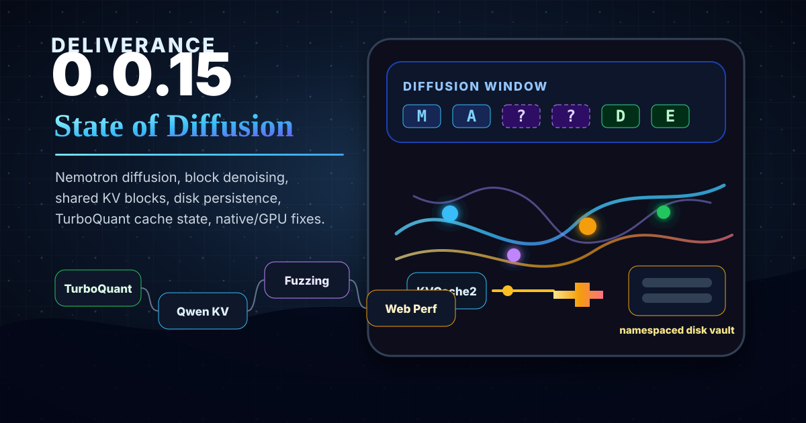

# Deliverance 0.0.15 Release Notes: State of Diffusion



Deliverance 0.0.15 is the "State of Diffusion" release. The name comes from the Nemotron Labs Diffusion work, but it also fits the rest of the cycle: cache state moved from request-local memory toward shared immutable KV blocks and disk persistence, while lower-level tensor, native, GPU, and web paths continued to settle into a more usable runtime.

These notes summarize the user-facing and developer-facing changes from `v0.0.14` through `v0.0.15`.

## Highlights

- Added Nemotron Labs Diffusion model support and documentation for AR, diffusion, and linear self-speculation workflows.
- Added first-class shared KVCache2 prefix blocks with immutable block identity, leases, memory admission, and prefix reuse.
- Added exact-layout dense disk persistence for shared KV blocks.
- Added exact-layout TurboQuant disk persistence for shared KV blocks.
- Added namespaced KV disk-cache directories so incompatible model/cache fingerprints are isolated under separate subfolders.
- Improved Qwen KV configuration paths and benchmark coverage.
- Continued native SIMD, GPU, F32/Q4, group-decode, and tensor fuzzing work.
- Fixed web startup/provider behavior that hurt HTTP inference performance.

## Nemotron Labs Diffusion

Major reference: [860ed1e Nemo diffusion](https://github.com/edwardcapriolo/deliverance/commit/860ed1e) ([#194](https://github.com/edwardcapriolo/deliverance/pull/194)).

0.0.15 adds support for the `nemotron_labs_diffusion` model family. This is not just another autoregressive model path. The model can run traditional AR generation and block-diffusion style generation, where masked regions are denoised and accepted in groups.

The diffusion work includes:

- `NemotronLabsDiffusionModel` and model-family registration.
- AR generation path support.
- Diffusion and linear self-speculation generation modes.
- Packed block attention and KVCache2 integration work.
- Generation-mode configuration and benchmark scripts.
- Documentation in [Nemotron Labs Diffusion support](../core/nemotron_labs_diffusion.md).

The practical result is a local Java playground for generation strategies that are not limited to one-token-at-a-time decoding.

## Shared KV Blocks

Major references:

- [247e48d New path includes prefix cache](https://github.com/edwardcapriolo/deliverance/commit/247e48d) ([#199](https://github.com/edwardcapriolo/deliverance/pull/199))
- [fc01ca0 kv-cache size tunable](https://github.com/edwardcapriolo/deliverance/commit/fc01ca0) ([#200](https://github.com/edwardcapriolo/deliverance/pull/200))
- [ada5b5e shared kv](https://github.com/edwardcapriolo/deliverance/commit/ada5b5e) ([#208](https://github.com/edwardcapriolo/deliverance/pull/208))

KVCache2 gained a shared-block prefix cache mode built around immutable committed blocks rather than whole-session snapshots.

Important pieces include:

- `PrefixCacheMode.SHARED_BLOCKS` alongside the older snapshot mode.
- `KvBlockKey`, `KvBlock`, `KvBlockLease`, and `KvBlockManager`.
- Request-local `KvCacheSession` support for detaching, attaching, retaining, and releasing committed block leases.
- Prefix lookup/admission wiring in local generation.
- Byte-budgeted memory eviction for shared blocks.
- Profiler counters for lookup, hit, miss, retain, release, admission, and reuse behavior.

This makes prefix reuse more granular and sets up persistence without requiring entire KV sessions to be copied as monolithic snapshots.

## Disk KV Persistence

Major references:

- [dc80a34 Add dense disk persistence for shared KV blocks](https://github.com/edwardcapriolo/deliverance/commit/dc80a34) ([#209](https://github.com/edwardcapriolo/deliverance/pull/209))
- [1deed34 Persist TurboQuant shared KV blocks](https://github.com/edwardcapriolo/deliverance/commit/1deed34) ([#210](https://github.com/edwardcapriolo/deliverance/pull/210))
- [92adefb KV cache directory layout](https://github.com/edwardcapriolo/deliverance/commit/92adefb)

Shared KV blocks can now be persisted to disk in exact runtime layout.

Dense persistence supports:

- `DENSE` KV block layout.
- `I8`, `BF16`, and `F32` storage where the runtime layout already matches the block.
- Async write queue and checksum-protected payloads.
- Disk byte-budget eviction using recorded last-access time.
- Safety gates for minimum cache size, reserved free space, writer queue pressure, and unsupported layouts.

TurboQuant persistence adds:

- Exact encoded payload persistence for `MSE_TURBOQUANT` blocks.
- Packed-code and row-norm serialization.
- Temp-directory integration coverage for small prompt persistence and reload.

The disk layout now uses namespace subdirectories:

```text
<root>/<namespace-hash>/<block-hash>.bin
<root>/<namespace-hash>/<block-hash>.meta.json
```

The namespace hash is derived from compatibility fields such as model, adapter, tokenizer, rope and attention settings, KV dtypes, layout, TurboQuant bits, tensor-parallel rank, and shard identity. The full block key is still stored in metadata and still contributes to the block hash.

## Qwen, TurboQuant, And KV Configuration

Major references:

- [d105b96 The return of turboquant](https://github.com/edwardcapriolo/deliverance/commit/d105b96) ([#197](https://github.com/edwardcapriolo/deliverance/pull/197))
- [a650ba6 Qwen kv switch](https://github.com/edwardcapriolo/deliverance/commit/a650ba6) ([#198](https://github.com/edwardcapriolo/deliverance/pull/198))

This release keeps moving KV storage from hardcoded behavior toward explicit runtime configuration.

Notable work includes:

- Qwen KV path updates.
- TurboQuant KVCache2 storage experiments.
- Prefix-cache TurboQuant documentation and tradeoff notes.
- Benchmark/config support for dense and TurboQuant KV cache variants.
- Runtime profiler counters that make cache behavior visible during benchmark and web runs.

TurboQuant remains an important compression path, but it is not a universal speed win. Dense `I8` KV is still the safer performance baseline for live decode until a specific model/config proves otherwise.

## Native, GPU, And Tensor Runtime Work

Major references:

- [edbcdfa F32 q4 fix](https://github.com/edwardcapriolo/deliverance/commit/edbcdfa) ([#201](https://github.com/edwardcapriolo/deliverance/pull/201))
- [0dd2977 Group decode and fuzzer fix](https://github.com/edwardcapriolo/deliverance/commit/0dd2977) ([#202](https://github.com/edwardcapriolo/deliverance/pull/202))
- [4ed5d2b Native builds](https://github.com/edwardcapriolo/deliverance/commit/4ed5d2b) ([#203](https://github.com/edwardcapriolo/deliverance/pull/203))
- [2be1493 Tenson fuzz](https://github.com/edwardcapriolo/deliverance/commit/2be1493) ([#204](https://github.com/edwardcapriolo/deliverance/pull/204))
- [69d61a7 Native builds](https://github.com/edwardcapriolo/deliverance/commit/69d61a7) ([#205](https://github.com/edwardcapriolo/deliverance/pull/205))

The lower-level runtime continued to receive correctness and build-system attention:

- F32/Q4 fixes.
- Group decode fixes.
- Native build follow-up work.
- Tensor-operation fuzzing and parity tests.
- Native SIMD and GPU test coverage for more edge cases.
- GPU submit serialization and Qwen-shaped concurrent GEMM stress coverage during release stabilization.

This work is not always visible at the API level, but it is the difference between a model demo and an inference engine that can survive real tensor shapes, offsets, chunking, and repeated runs.

## Web And HTTP Performance

Major reference: [3af1563 fix http performance issue](https://github.com/edwardcapriolo/deliverance/commit/3af1563) ([#211](https://github.com/edwardcapriolo/deliverance/pull/211)).

The web path received an important performance fix around tensor-provider construction and runtime configuration.

Highlights include:

- Preserving auxiliary tensor providers when a primary provider is selected for web inference.
- Better visibility into chosen provider and split-size behavior at startup.
- Web configuration support for pool size and SIMD split-size tuning.
- Profile summary/counter output around chat generation when profiler output is enabled.
- Nanocode/Qwen4B server configuration work used to validate the HTTP path under concurrent client sessions.

The practical effect is that web inference is less likely to silently fall into a slow provider configuration.

## Compatibility And Operational Notes

- Disk KV cache entries from the previous flat root layout will not be found by the new namespace-directory layout. They are cache artifacts and can be deleted or left to be replaced.
- The disk cache key protects logical compatibility, but the model fingerprint is still derived from model path/config identity rather than hashing every weight byte.
- TurboQuant disk persistence is exact-layout persistence. It is not an automatic dtype/layout conversion layer.
- Shared KV block reuse remains block-aligned. Non-aligned prompt suffixes still prefill normally after reused blocks.
- GPU acceleration remains targeted. Unsupported shapes and offsets fall back to the configured CPU delegate.
- Diffusion generation support is newer than the classic AR path and should be treated as a fast-moving area for benchmarking and behavior checks.

## Closing

0.0.15 is a cache-state release and a diffusion release: blocks can now outlive a request, cache identity is more explicit, and the model stack can explore denoising-style generation without leaving the Java runtime.
