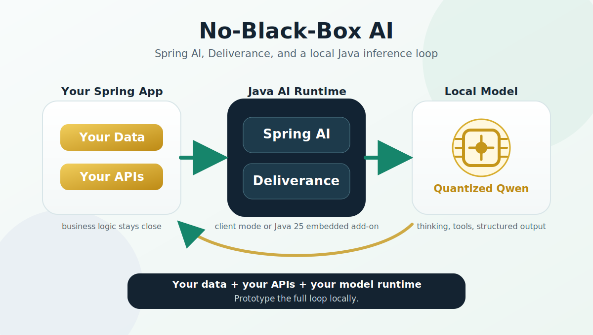

# Deliverance For Spring AI

Deliverance brings a Java provider to Spring AI for inference.
With Deliverance you can get a powerful local inference engine without paying a model provider and without sending private data outside your network.
If you already use Spring AI, the value is straightforward: the application is Java, the integration is Java, and the inference path can be Java too.
You can understand the dependencies, take a stack trace, patch the code, and look under the hood when something matters.

Deliverance is for the Java-first path: Spring AI on top, Deliverance underneath, your data and APIs staying on your gear.

## Easy To Get Started

You do not need to rewrite your Spring application around a new programming model.
Start a Deliverance server with the model you want, add one dependency, and keep writing Spring AI code.

The dependency is small and direct:

```xml
<dependency>
  <groupId>io.teknek.deliverance</groupId>
  <artifactId>spring-ai-deliverance</artifactId>
  <version>${deliverance.version}</version>
</dependency>
```

Then point Spring AI at your local Deliverance server:

```yaml
spring:
  ai:
    deliverance:
      mode: client
      base-url: http://localhost:8080
      model: edwardcapriolo/Qwen3-4B-JQ4
```

That is enough to put Spring AI in front of a local quantized model.
Your Spring service stays lightweight, and Deliverance owns model loading and inference nearby on hardware you control.
Run Deliverance from [Docker/Testcontainers](README.md#tests) using published [Docker Hub images](https://hub.docker.com/repository/docker/ecapriolo/deliverance), or go all the way in-process with the [embedded add-on](README.md#embedded-add-on).

## Easy To Use

Use Deliverance the same way you use other Spring AI providers, with idiomatic `Prompt` and `ChatModel` calls and little to no feature disparity for local workflows.
For example, a private code-review service can ask for a schema-shaped response directly from a local model:

```java
private static final String REVIEW_SCHEMA = """
    {
      "type": "object",
      "required": ["summary", "riskLevel", "findings"]
    }
    """;

public PullRequestReviewResponse reviewPullRequest(PullRequestReviewRequest request) throws IOException {
    String response = chatModel.call(new Prompt(
            renderReviewPrompt(request),
            DeliveranceChatOptions.builder()
                    .temperature(0.0)
                    .maxTokens(512)
                    .guidedJson(REVIEW_SCHEMA)
                    .build()))
            .getResult()
            .getOutput()
            .getText();

    return objectMapper.readValue(response, PullRequestReviewResponse.class);
}
```

The code review data stays in your network, the Spring service gets a typed response, and the model call still uses the Spring AI `ChatModel` abstraction.

Want to see the full version?
We built a PR review app around Spring AI and Deliverance: [open the demo](../spring-ai-deliverance-demo/).

## Whats next?

Start with the [Spring AI Deliverance README](README.md) for the dependency, properties, options, and test setup.

Want to learn more about Deliverance itself?
Read the [main Deliverance README](../README.md).
